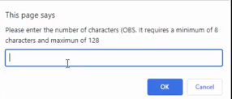
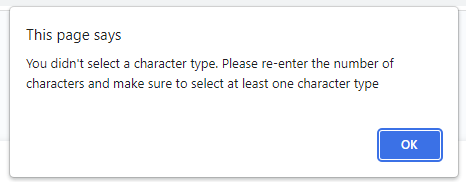
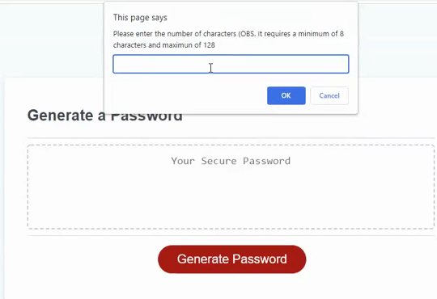

# Password Generator - JavaScript

## Objectives:
Create an application that enables employees to generate random passwords. 

The password must contain at least 8 characters (max 128 characters) and the option to include 1 or more of the following character types:
    - lowercase letters
    - Uppercase letters
    - numbers
    - special characters

## Preview - Password Generator - Example:

## Coding - Java Script

1. Window Prompts and alerts created to request the User's choice:

2. A secure random password is generated once the user inputs the following:

    2.1. Password's Length (ranging from 8 to 128 characters). In case the user inputs a number, special character or a number less than 8 or greater than 128, the user will receive a message asking for a valid number in the correct range. 

    

    2.2. The option to include lowercase letters, Uppercase letters, Numbers and/or special characters.

    2.3. In case the user does not select any character type, a message is displayed in order to start the process again and choose a type:

    

3. If statements created for each scenario, in case the user decides not to include one or more character types. 
Example below: password is generated without numbers and Uppercase letters (only lowerCase and a special character):

## Link to application available at:

URL: https://renatatims.github.io/password-generator/

